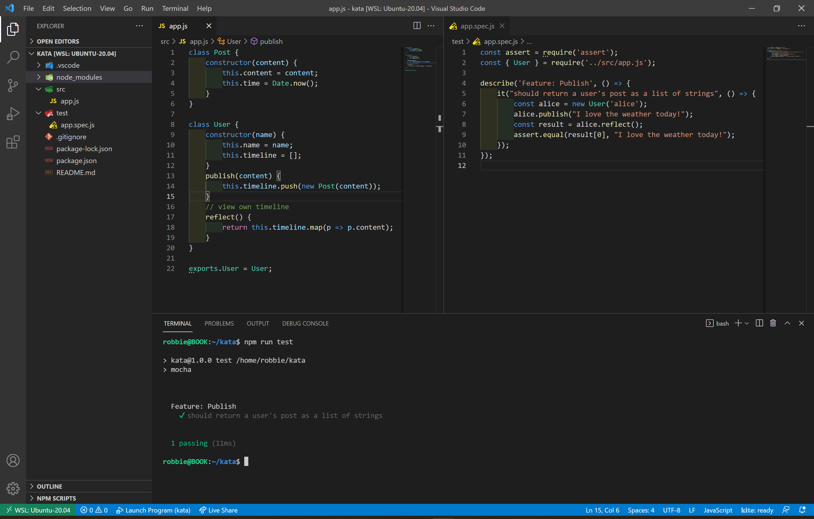

# Social Networking Kata

A kata prompted by the good folks at integral.io

## Run

Clone this repo down and cd into it, then run
```bash
npm i 
npm run test
```

## Test 

To generate a coverage report, run 
```
npm run coverage-report
```
And open coverage/index.html in your browser

### Publishing

The below requirements prompted me to write test case before I even opened app.js
  
```
Scenario: Alice publishes messages to her personal timeline.   
    Given Alice has published "I love the weather today."
    When Alice views her timeline
    Then Alice sees:
        "I love the weather today."
```



### Timeline

The next prompt gave me a chance to use node-time-ago, glad to have it!

```
Scenario: Alice views Bob's timeline.
    Given Bob has published "Darn! We lost!"
    And Bob has published "Good game though."
    When Alice views Bob's timeline
    Then Alice sees:
        Good game though. (1 minute ago)
        Darn! We lost! (2 minute ago)
```


### Following 

This one tripped me up a bit :3

```
Scenario: Charlie can follow Alice and Bob, and he views an aggregated list of all timelines.
    Given Alice has published "I love the weather today."
    And Bob has published "Darn! We lost!"
    And Bob has published "Good game though."
    And Charlie has published "I'm in New York today! Anyone wants to have a coffee?"
    When Charlie follows Alice
    And Charlie follows Bob
    And Charlie views his wall
    Then Charlie sees:
        Charlie - I'm in New York today! Anyone wants to have a coffee? (15 seconds ago)     
        Bob - Good game though. (1 minute ago)     
        Bob - Damn! We lost! (2 minutes ago)     
        Alice - I love the weather today (5 minutes ago)  
```


Woo!